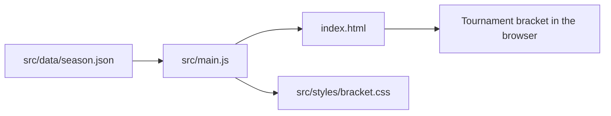

# Official Code Chess Club

A small web app for following the universitie's "Official Code Chess Club" tournament bracket.


## What This Is

This project is a visual tournament tracker for a university chess club. It shows the tournament rounds, players, match results, who has advanced, and eventually the champion.

It is not a chess engine and it does not let people play chess online. Think of it more like a digital tournament poster.

## Why It Exists

Chess tournaments are more fun when everyone can quickly see what is happening. This app gives the Official Code Chess Club a simple place to follow the bracket without digging through messages, spreadsheets, or notes.

The project is intentionally small: the tournament data lives in one JSON file, and the app turns that data into a styled bracket in the browser.

## What You Can Do With It

- Browse each tournament round from the opening matches to the final.
- See completed matches and which players moved forward.
- Check which matches are still pending.
- Update the season by editing `src/data/season.json`.
- Run the project locally or build it as a static website.

## How It Works

The app starts with tournament data in `src/data/season.json`. JavaScript in `src/main.js` reads that data, works out the current bracket state, and renders the result into the page defined by `index.html`. The visual design comes from `src/styles/bracket.css`.



In plain English: update the season data, reload the app, and the bracket changes.

## Tech Stack

- HTML provides the page structure and round tabs.
- CSS controls the bracket layout, colors, spacing, and responsive design.
- JavaScript turns the tournament data into visible matches and winners.
- JSON stores the season information in a structured, editable format.
- Vite runs the local development server and creates production builds.

## Project Structure

- `index.html` - the page shell, header, and tab containers for each round.
- `src/main.js` - the bracket rendering logic.
- `src/styles/bracket.css` - the visual styling for the tournament page.
- `src/data/season.json` - the source of truth for players, dates, rounds, matches, and winners.
- `package.json` - project scripts and development dependencies.

## Run It Locally

Install the dependencies once:

```bash
npm install
```

Start the local development server:

```bash
npm run dev
```

Vite will print a local URL in the terminal, usually `http://localhost:5173`. Open that URL in your browser to see the bracket.

## Build It

Create a production build:

```bash
npm run build
```

Preview the production build locally:

```bash
npm run preview
```

`npm run preview` serves the built output from `dist`, which is useful for checking the app before publishing it.

## Update The Tournament Data

Most tournament updates happen in `src/data/season.json`.

That file contains the season title, round dates, player names, match pairings, and winners. The bracket reads from this file each time the app loads.

For example, a match looks like this:

```json
{
  "id": "r1-1",
  "playerA": "Simon <Surname>",
  "playerB": "Alexandru <Surname>",
  "winner": "B"
}
```

The `winner` field tells the app who won:

- `"A"` means `playerA` won.
- `"B"` means `playerB` won.
- Omitting `winner` or setting it to `null` keeps the match pending.

The later rounds are also listed in `season.json`. When earlier winners are known, the app can carry them forward into the next round and display the updated bracket.

## Useful Commands

- `npm run dev` - start the local development server.
- `npm run build` - build the static production files.
- `npm run preview` - preview the production build locally.
- `npm run lint` - run ESLint checks.